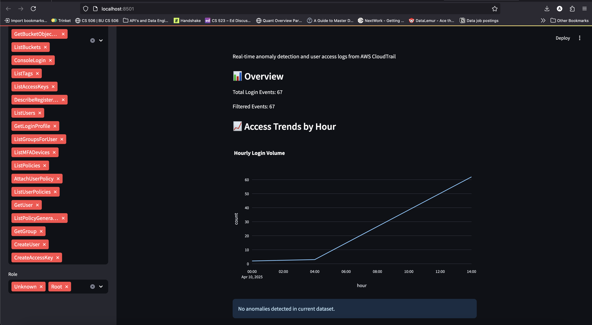

# ☁️ Cloud Access Monitoring Dashboard

A real-time dashboard to detect and visualize suspicious access activity from AWS CloudTrail logs using anomaly detection, role-based filtering, and email alerting via AWS Lambda and SES.

---

## 🚀 Features

- ✅ Pulls CloudTrail logs from an S3 bucket
- 🔍 Filters access events by user roles and event types
- 📊 Detects anomalies in login frequency using time-series analysis
- 📩 Sends email alerts using AWS Lambda + SES
- 🎯 Visualizes access trends and anomalies via a Streamlit dashboard

---

## 📁 Project Structure

```
cloud-access-monitoring-dashboard/
├── app.py                      # Streamlit Dashboard
├── cloudtrail_log_parser.py   # Downloads and parses logs from S3
├── access_monitor.py          # Role-based filter + anomaly detection
├── alert_system.py            # AWS Lambda alert trigger via SES
├── parsed_cloudtrail_events.csv
├── anomaly_events.csv
├── requirements.txt
├── screenshots/
│   ├── dashboard_view.png
│   ├── login_anomaly_plot.png
│   └── email_alert.png
```

---

## 🛠 Tech Stack

- **AWS Services**: CloudTrail, Lambda, SES, S3
- **Backend**: Python (Pandas, Boto3, Scikit-Learn)
- **Dashboard**: Streamlit + Plotly
- **Anomaly Detection**: Z-score, Time-series trend deviation

---

## 🧪 How It Works

1. **CloudTrail Setup**
   - Enable CloudTrail to log management events.
   - Set an S3 bucket as the destination.

2. **Log Parsing**
   - `cloudtrail_log_parser.py` connects to S3 and pulls log files.
   - Extracts login events (e.g., ConsoleLogin, AssumeRole) into a CSV.

3. **Role Filtering + Anomaly Detection**
   - `access_monitor.py` tags user roles (Admin, Dev, External)
   - Applies z-score on time-series login volume to detect anomalies

4. **Alerts**
   - `alert_system.py` sends alert emails using AWS Lambda + SES
   - Triggers can be scheduled via CloudWatch or manually invoked

5. **Visualization**
   - `app.py` uses Streamlit to render:
     - Login patterns
     - Anomaly spikes
     - Raw event table

---

## 📸 Screenshots

| Dashboard View | Anomaly Detection | Email Alert |
|----------------|-------------------|-------------|
|  |  |  |

---

## 📦 Installation

```bash
git clone https://github.com/[YourName]/cloud-access-monitoring-dashboard.git
cd cloud-access-monitoring-dashboard
pip install -r requirements.txt
streamlit run app.py
```

---

## ⚙️ Environment Setup

### AWS Setup
- Enable CloudTrail
- Create and verify email with SES (sandbox mode)
- Add IAM roles for S3 read and SES send access
- Create AWS Lambda with `alert_system.py`

---

## 📌 Future Improvements

- 🟡 Add real-time streaming with Kafka/Spark
- 🟡 Deploy as serverless app with AWS EventBridge triggers
- 🟡 Integrate Slack/Teams alerting
- 🟡 Add anomaly classification with IsolationForest or LSTM

---

## 👤 Author

Arunesh Kumar Lal  
📧 aklal@bu.edu  
🔗 [LinkedIn](https://www.linkedin.com/in/arunesh-kumar-lal/)  
📂 [Portfolio](https://datascienceportfol.io/aklal?linkedin)

---

## 🛡 License
Use freely, improve collaboratively.
